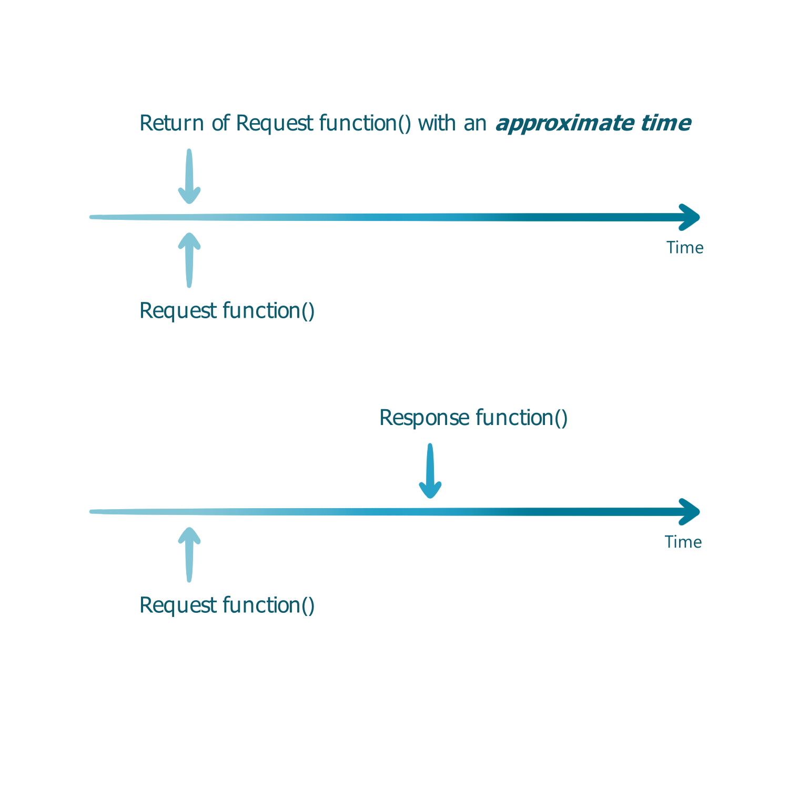
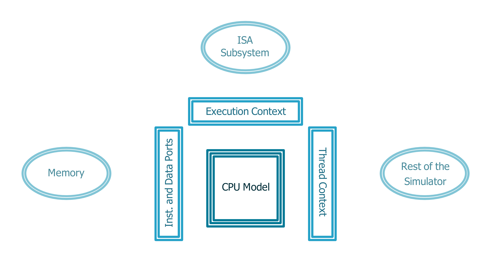

<!-- _class: title -->

## Modeling CPU cores in gem5

---

## Outline

- **Learn about CPU models in gem5​**
  - AtomicSimpleCPU, TimingSimpleCPU, O3CPU, MinorCPU, KvmCPU​
- Using the CPU models​
  - Set-up a simple system with two cache sizes and three CPU models​
- Look at the gem5 generated statistics​
  - To understand differences among CPU models
- Create a custom processor
  - Change parameters of a processor based on O3CPU

---

## gem5 CPU Models


---

<!-- _class: start --->

## Simple CPU

---

## SimpleCPU

### Atomic

Sequency of nested calls
Use: Warming up, fast-forwarding

### Functional

Backdoor access to mem.
(loading binaries)
No effect on coherency states

### Timing

Split transactions
Models queuing delay and
resource contention


---

## Other Simple CPUs

### AtomicSimpleCPU

- Uses **_Atomic_** memory accesses
  - No resource contentions or queuing delay
  - Mostly used for fast-forwarding and warming of caches

### TimingSimpleCPU

- Uses **_Timing_** memory accesses
  - Execute non-memory operations in one cycle
  - Models the timing of memory accesses in detail

---

## O3CPU (Out of Order CPU Model)

- **_Timing_** memory accesses _execute-in-execute_ semantics
- Time buffers between stages


---

## The O3CPU Model has many parameters

[src/cpu/o3/BaseO3CPU.py](../../gem5/src/cpu/o3/BaseO3CPU.py)

```python
decodeToFetchDelay = Param.Cycles(1, "Decode to fetch delay")
renameToFetchDelay = Param.Cycles(1, "Rename to fetch delay")
...
fetchWidth = Param.Unsigned(8, "Fetch width")
fetchBufferSize = Param.Unsigned(64, "Fetch buffer size in bytes")
fetchQueueSize = Param.Unsigned(
    32, "Fetch queue size in micro-ops per-thread"
)
...
```

Remember, do not update the parameters directly in the file. Instead, create a new _stdlib component_ and extend the model with new values for parameters.
We will do this soon.

---

## MinorCPU


<!-- 'https://nitish2112.github.io/post/gem5-minor-cpu/' Add "footer: " within the comment to make it appear on the slide-->

---

## KvmCPU

- KVM – Kernel-based virtual machine
- Used for native execution on x86 and ARM host platforms
- Guest and the host need to have the same ISA
- Very useful for functional tests and fast-forwarding

---

## Summary of gem5 CPU Models

### BaseKvmCPU

- Very fast
- No timing
- No caches, BP

### BaseSimpleCPU

- Fast
- Some timing
- Caches, limited BP

### DerivO3CPU and MinorCPU

- Slow
- Timing
- Caches, BP


---

## Interaction of CPU model with other parts of gem5


---

## Outline

- CPU models in gem5​
  - AtomicSimpleCPU, TimingSimpleCPU, O3CPU, MinorCPU, KvmCPU​
- **Using the CPU models​**
  - Set-up a simple system with two cache sizes and three CPU models​
- Look at the gem5 generated statistics​
  - To understand differences among CPU models
- Create a custom processor
  - Change parameters of a processor based on O3CPU

---

<!-- _class: start -->

## Let's use these CPU Models!

---

## Material to use

### Start by opening the following file.

[materials/02-Developing-gem5-model/05-modeling-cores/04-cores/cores.py](../../materials/02-Developing-gem5-model/05-modeling-cores/04-cores/cores.py)

### Steps

1. Configure a simple system with Atomic CPU
2. Configure the same system with Timing CPU
3. Reduce the cache size
4. Change the CPU type back to Atomic

We will be running a program (workload) called **matrix-multiply** on our board.

---

## Let's configure a simple system with Atomic CPU

[materials/02-Developing-gem5-model/05-modeling-cores/04-cores/cores.py](../../materials/02-Developing-gem5-model/05-modeling-cores/04-cores/cores.py)

```python
from gem5.resources.resource import obtain_resource
from gem5.simulate.simulator import Simulator
from gem5.components.boards.simple_board import SimpleBoard
from gem5.components.cachehierarchies.classic.private_l1_cache_hierarchy import PrivateL1CacheHierarchy
from gem5.components.memory.single_channel import SingleChannelDDR3_1600
from gem5.components.processors.simple_processor import SimpleProcessor
from gem5.components.processors.cpu_types import CPUTypes
from gem5.isas import ISA


# A simple script to test with different CPU models
# We will run a simple application (matrix-multiply) with AtomicSimpleCPU, TimingSimpleCPU,
# and O3CPU using two different cache sizes

...
```

---

## Let's start with Atomic CPU

`cpu_type` in cores.py should already be set to Atomic.

```python
# Comment out the cpu_types you don't want to use and
# Uncomment the one you do want to use
cpu_type = CPUTypes.ATOMIC
# cpu_type = CPUTypes.TIMING
```

Let's run it!

```sh
gem5 --outdir=atomic-normal-cache cores.py
```

Make sure the out directory is set to **atomic-normal-cache**.

---

## Next, try Timing CPU

Change `cpu_type` in cores.py to Timing.

```python
# Comment out the cpu_types you don't want to use and
# Uncomment the one you do want to use
# cpu_type = CPUTypes.ATOMIC
cpu_type = CPUTypes.TIMING
```

Let's run it!

```sh
gem5 --outdir=timing-normal-cache cores.py
```

Make sure the out directory is set to **timing-normal-cache**.

---

## Now, try changing the Cache Size

Go to this line of code.

```python
cache_hierarchy = PrivateL1CacheHierarchy(l1d_size="32KiB", l1i_size="32KiB")
```

Change `l1d_size` and `l1i_size` to 1KiB.

```python
cache_hierarchy = PrivateL1CacheHierarchy(l1d_size="1KiB", l1i_size="1KiB")
```

Let's run it!

```sh
gem5 --outdir=timing-small-cache cores.py
```

Make sure the out directory is set to **timing-small-cache**.

---

## Now let's try a Small Cache with Atomic CPU

Set `cpu_type` in cores.py to Atomic.

```python
# Comment out the cpu_types you don't want to use and
# Uncomment the one you do want to use
cpu_type = CPUTypes.ATOMIC
# cpu_type = CPUTypes.TIMING
```

Let's run it!

```sh
gem5 --outdir=atomic-small-cache cores.py
```

Make sure the out directory is set to **atomic-small-cache**.

---

## Outline

- CPU models in gem5​
  - AtomicSimpleCPU, TimingSimpleCPU, O3CPU, MinorCPU, KvmCPU
- Using the CPU models​
  - Set-up a simple system with two cache sizes and three CPU models​
- **Look at the gem5 generated statistics​**
  - To understand differences among CPU models
- Create a custom processor
  - Change parameters of a processor based on O3CPU

---

<!-- _class: start -->

## Statistics

---

## Look at the Number of Operations

Run the following command.

```sh
grep -ri "simOps" *cache
```

Here are the expected results. (Note: Some text is removed for readability.)

```sh
atomic-normal-cache/stats.txt:simOps                                       33954560
atomic-small-cache/stats.txt:simOps                                        33954560
timing-normal-cache/stats.txt:simOps                                       33954560
timing-small-cache/stats.txt:simOps                                        33954560
```

---

## Look at the Number of Execution Cycles

Run the following command.

```sh
grep -ri "cores0.*numCycles" *cache
```

Here are the expected results. (Note: Some text is removed for readability.)

```sh
atomic-normal-cache/stats.txt:board.processor.cores0.core.numCycles        38157549
atomic-small-cache/stats.txt:board.processor.cores0.core.numCycles         38157549
timing-normal-cache/stats.txt:board.processor.cores0.core.numCycles        62838389
timing-small-cache/stats.txt:board.processor.cores0.core.numCycles         96494522
```

Note that for Atomic CPU, the number of cycles is the **same** for a large cache _and_ a small cache.

This is because Atomic CPU ignores memory access latency.

---

## Extra Notes about gem5 Statistics

When you specify the out-directory for the stats file (when you use the flag `--outdir=<outdir-name>`), go to **\<outdir-name>/stats.txt** to look at the entire statistics file.

For example, to look at the statistics file for the Atomic CPU with a small cache, go to **atomic-small-cache/stats.txt**.

In general, if you don't specify the out-directory, it will be **m5out/stats.txt**.

### Other statistics to look at

- Host time (time taken by gem5 to run your simulation)
  - _hostSeconds_

---

## Outline

- CPU models in gem5​
  - AtomicSimpleCPU, TimingSimpleCPU, O3CPU, MinorCPU, KvmCPU​

- Using the CPU models​
  - Set-up a simple system with two cache sizes and three CPU models​

- Look at the gem5 generated statistics​
  - To understand differences among CPU models

---

<style scoped>
  h2{
    margin-bottom: 60px;
  }
</style>

## Summary of gem5 CPU Models


---

## Outline

- **CPU models in gem5​**
  - AtomicSimpleCPU, TimingSimpleCPU, O3CPU, MinorCPU, KvmCPU​

- Using the CPU models​
  - Set-up a simple system with two cache sizes and three CPU models​

- Look at the gem5 generated statistics​
  - To understand differences among CPU models

---

<style scoped>
  div.line{
    display: flex;
    padding: 250px 50px 0;
    font-weight: normal;
  }
  span {
    flex: 5;
    text-align: center;
    line-height: 75px;

  }
  span.left {
    font-size: 5rem;
    font-weight: bold;
    background-size: 1000px 1000px;
    background: linear-gradient(to right,rgb(67,124,205), rgb(69,214,202));
    -webkit-background-clip: text;
    -webkit-text-fill-color: transparent;
  }
  span.right {
    font-size: 1.9rem;
  }
  span.center {
    flex: 0.25;

  }
  div.bar {
    display: inline-block;
    width: 0px;
    border: 1px solid black;
    height: 100px;
    margin-top: -15px;
  }
</style>

<div class="line"><span class="left">SimpleCPU</span>

<span class="center">

<div class="bar"></div></span>
<span class="right">Functional, In-Order CPU Models</span></div>

---

<!--> Make this a class? <-->
<!-- <style scoped>
  h3{
    /* font-size: 1.8rem; */
  }
  h2{
    margin-bottom: 60px;
  } -->

</style>

## SimpleCPU

### **Atomic**

Seq. of nested calls
Use: Warming up, FF
<!-- </br> -->

### **Functional**

Backdoor access to mem.
(loading binaries)
No effect on coherency states
<!-- </br> -->

### **Timing**

Split transactions
Models queuing delay and
resource contention


<!--  -->

---

<!-- <style scoped>
  h3{
    font-size: 1.8rem;
    margin-bottom: 0px;
    line-height: 0px;
  }
  h2{
    margin-bottom: 60px;
  } -->

## Other Simple CPUS


### AtomicSimpleCPU

- Uses **_Atomic_** memory accesses
  - No resource contentions or queuing delay
  - Mostly used for fast-forwarding and warming of caches

</br>

### TimingSimpleCPU

- Uses **_Timing_** memory accesses
  - Execute non-memory operations in one cycle
  - Models the timing of memory accesses in detail

---

## O3CPU (Out of Order CPU Model)

- **_Timing_** memory accesses _execute-in-execute_ semantics
- Time buffers between stages

---

## O3CPU Model Parameters (very configurable)

src/cpu/o3/BaseO3CPU.py

```python
    decodeToFetchDelay = Param.Cycles(1, "Decode to fetch delay")
    renameToFetchDelay = Param.Cycles(1, "Rename to fetch delay")
    iewToFetchDelay = Param.Cycles(1, "Issue/Execute/Writeback to fetch delay")
    commitToFetchDelay = Param.Cycles(1, "Commit to fetch delay")
    fetchWidth = Param.Unsigned(8, "Fetch width")
    fetchBufferSize = Param.Unsigned(64, "Fetch buffer size in bytes")
    fetchQueueSize = Param.Unsigned(
        32, "Fetch queue size in micro-ops per-thread"
    )
```

---

## O3CPU Model Parameters (very configurable)

src/cpu/o3/BaseO3CPU.py

```python
    renameToDecodeDelay = Param.Cycles(1, "Rename to decode delay")
    iewToDecodeDelay = Param.Cycles(
        1, "Issue/Execute/Writeback to decode delay"
    )
    commitToDecodeDelay = Param.Cycles(1, "Commit to decode delay")
    fetchToDecodeDelay = Param.Cycles(1, "Fetch to decode delay")
    decodeWidth = Param.Unsigned(8, "Decode width")
```
---

## O3CPU Model Parameters (very configurable)

src/cpu/o3/BaseO3CPU.py

```python
    LQEntries = Param.Unsigned(32, "Number of load queue entries")
    SQEntries = Param.Unsigned(32, "Number of store queue entries")
    LSQDepCheckShift = Param.Unsigned(
        4, "Number of places to shift addr before check"
    )
    LSQCheckLoads = Param.Bool(
        True,
        "Should dependency violations be checked for "
        "loads & stores or just stores",
    )
```
---

## O3CPU Model Parameters (very configurable)

src/cpu/o3/BaseO3CPU.py

```python
    store_set_clear_period = Param.Unsigned(
        250000,
        "Number of load/store insts before the dep predictor "
        "should be invalidated",
    )
    LFSTSize = Param.Unsigned(1024, "Last fetched store table size")
    SSITSize = Param.Unsigned(1024, "Store set ID table size")

    numRobs = Param.Unsigned(1, "Number of Reorder Buffers")

    numPhysIntRegs = Param.Unsigned(
        256, "Number of physical integer registers"
    )
```

---

## O3CPU Model Parameters (very configurable)

src/cpu/o3/BaseO3CPU.py

```python
    numPhysFloatRegs = Param.Unsigned(
        256, "Number of physical floating point registers"
    )
    numPhysVecRegs = Param.Unsigned(256, "Number of physical vector registers")
    numPhysVecPredRegs = Param.Unsigned(
        32, "Number of physical predicate registers"
    )
    numPhysMatRegs = Param.Unsigned(2, "Number of physical matrix registers")
    # most ISAs don't use condition-code regs, so default is 0
    numPhysCCRegs = Param.Unsigned(0, "Number of physical cc registers")
    numIQEntries = Param.Unsigned(64, "Number of instruction queue entries")
    numROBEntries = Param.Unsigned(192, "Number of reorder buffer entries")
```

---

## MinorCPU


<!-- 'https://nitish2112.github.io/post/gem5-minor-cpu/' Add "footer: " within the comment to make it appear on the slide-->

---

## KvmCPU

- KVM – Kernel-based virtual machine

- Used for native execution on x86 and ARM host platforms

- Guest and the host need to have the same ISA

- Very useful for functional tests and fast-forwarding

---

<style scoped>
  h3{
    font-size: 1.8rem;
    margin-bottom: 0;
    line-height: 0;
  }
  h2{
    margin-bottom: 0;
  }
</style>

## Summary of gem5 CPU Models

</br>

### **BaseKvmCPU**

- Very fast
- No timing
- No caches, BP
</br>

### **BaseSimpleCPU**

- Fast
- Some timing
- Caches, limited BP
</br>

### **DerivO3CPU and MinorCPU**

- Slow
- Timing
- Caches, BP

<!--  --> -->


---

<style scoped>
  h2{
    margin-bottom: -40px;
  }
</style>
## Interaction of CPU model with other parts of gem5




---

## Outline

- CPU models in gem5​
  - AtomicSimpleCPU, TimingSimpleCPU, O3CPU, MinorCPU, KvmCPU​

- **Using the CPU models​**
  - Set-up a simple system with two cache sizes and three CPU models​

- Look at the gem5 generated statistics​
  - To understand differences among CPU models

---

<style scoped>
  div.line{
    padding-top: 250px;
    font-size: 4rem;
    text-align: center;
    font-weight: bold;
    line-height: 75px;
    background: linear-gradient(to right,rgb(67,124,205), rgb(69,214,202));
    -webkit-background-clip: text;
    -webkit-text-fill-color: transparent;
  }
</style>

<div class="line">Let's use these CPU Models!</div>

---

## Material to use

<!-- gem5bootcamp/2024/materials/using-gem5/04-cores/
&nbsp;&nbsp;&nbsp;&nbsp;&nbsp;&nbsp;cores.py
&nbsp;&nbsp;&nbsp;&nbsp;&nbsp;&nbsp;cores-complex.py
&nbsp;&nbsp;&nbsp;&nbsp;&nbsp;&nbsp;components/ -->

### Start by opening the following file

gem5bootcamp/2024/materials/using-gem5/04-cores/cores.py

---

## Let's configure a simple system with Atomic CPU

gem5bootcamp/2024/materials/developing-gem5-models/04-cores/cores.py
```python
from gem5.resources.resource import obtain_resource
from gem5.simulate.simulator import Simulator
from gem5.components.boards.simple_board import SimpleBoard
from gem5.components.cachehierarchies.classic.private_l1_cache_hierarchy import PrivateL1CacheHierarchy
from gem5.components.memory.single_channel import SingleChannelDDR3_1600
from gem5.components.processors.simple_processor import SimpleProcessor
from gem5.components.processors.cpu_types import CPUTypes
from gem5.isas import ISA


# A simple script to test with different CPU models
# We will run a simple application (matrix-multiply) with AtomicSimpleCPU, TimingSimpleCPU,
# and O3CPU using two different cache sizes

...
```

---

## Let's start with Atomic CPU

```cpu_type``` in cores.py should already be set to Atomic

```python
# Comment out the cpu_types you don't want to use and
# Uncomment the one you do want to use
cpu_type = CPUTypes.ATOMIC
# cpu_type = CPUTypes.TIMING
# cpu_type = CPUTypes.O3
```

> Let's run it!
> ```bash
> gem5 --outdir=atomic-normal-cache ./materials/developing-gem5-models/04-cores/cores.py
> ```
> Make sure the out directory is set to **atomic-normal-cache**
---

## Next, try Timing CPU

Change ```cpu_type``` in cores.py to Timing

```python
# Comment out the cpu_types you don't want to use and
# Uncomment the one you do want to use
# cpu_type = CPUTypes.ATOMIC
cpu_type = CPUTypes.TIMING
# cpu_type = CPUTypes.O3
```

> Let's run it!
> ```bash
> gem5 --outdir=timing-normal-cache ./materials/developing-gem5-models/04-cores/cores.py
>  ```
> Make sure the out directory is set to **timing-normal-cache**

---

## Now, try changing the Cache Size

Go to this line of code.

```python
cache_hierarchy = PrivateL1CacheHierarchy(l1d_size="32KiB", l1i_size="32KiB")
```

Change ```l1d_size``` and ```l1i_size``` to 1KiB.

```python
cache_hierarchy = PrivateL1CacheHierarchy(l1d_size="1KiB", l1i_size="1KiB")
```

> Let's run it!
>```bash
> gem5 --outdir=timing-small-cache ./materials/developing-gem5-models/04-cores/cores.py
>```
> Make sure the out directory is set to **timing-small-cache**

---

## Now let's try a Small Cache with Atomic CPU

Set ```cpu_type``` in cores.py to Atomic

```python
# Comment out the cpu_types you don't want to use and
# Uncomment the one you do want to use
cpu_type = CPUTypes.ATOMIC
# cpu_type = CPUTypes.TIMING
# cpu_type = CPUTypes.O3
```

> Let's run it!
> ```bash
> gem5 --outdir=atomic-small-cache ./materials/developing-gem5-models/04-cores/cores.py
> ```
> Make sure the out directory is set to **atomic-small-cache**

---

## Outline

- CPU models in gem5​
  - AtomicSimpleCPU, TimingSimpleCPU, O3CPU, MinorCPU, KvmCPU​

- Using the CPU models​
  - Set-up a simple system with two cache sizes and three CPU models​

- **Look at the gem5 generated statistics​**
  - To understand differences among CPU models

---

<style scoped>
  div.line{
    display: flex;
    padding: 250px 50px 0;
    font-weight: normal;
  }
  span {
    flex: 5;
    text-align: center;
    line-height: 75px;

  }
  span.left {
    font-size: 5rem;
    font-weight: bold;
    background-size: 1000px 1000px;
    background: linear-gradient(to right,rgb(67,124,205), rgb(69,214,202));
    -webkit-background-clip: text;
    -webkit-text-fill-color: transparent;
  }
  span.right {
    font-size: 1.9rem;
  }
  span.center {
    flex: 0.25;

  }
  div.bar {
    display: inline-block;
    width: 0px;
    border: 1px solid black;
    height: 100px;
    margin-top: -15px;
  }
</style>

<div class="line"><span class="left">Statistics</span>

<span class="center">

<div class="bar"></div></span>
<span class="right">Understanding gem5 statistics</span></div>

---

## Look at the Number of Operations

Run the following command

```bash
grep -ri "simOps" atomic-normal-cache atomic-small-cache timing-normal-cache timing-small-cache
```

Here are the expected results

```bash
atomic-normal-cache/stats.txt:simOps                                       33954560
atomic-small-cache/stats.txt:simOps                                        33954560
timing-normal-cache/stats.txt:simOps                                       33954560
timing-small-cache/stats.txt:simOps                                        33954560
```

---
## Look at the Number of Execution Cycles

Run the following command

```bash
grep -ri "numCycles" atomic-normal-cache atomic-small-cache timing-normal-cache timing-small-cache | grep "cores0"
```

Here are the expected results

```bash
atomic-normal-cache/stats.txt:board.processor.cores0.core.numCycles        38157549
atomic-small-cache/stats.txt:board.processor.cores0.core.numCycles         38157549
timing-normal-cache/stats.txt:board.processor.cores0.core.numCycles        62838389
timing-small-cache/stats.txt:board.processor.cores0.core.numCycles         96494522
```

Note that the number of cycles is the **same** for a large cache and a small cache that use Atomic CPU

This is because Atomic CPU ignores latencies for memory accesses

---

## Extra Notes about gem5 Statistics

When you specify the out-directory for the stats file (using the flag ```--outdir=<outdir-name>```), go to **\<outdir-name>/stats.txt** to look at the entire statistics file

For example, to look at the statistics file for the Atomic CPU with a small cache, go to **atomic-normal-cache/stats.txt**

In general, if you don't specify the out-directory, it will be **gem5/m5out/stats.txt**

### Other statistics to look at

- Host time (time taken by gem5 to run your simulation)
  - *hostSeconds*
