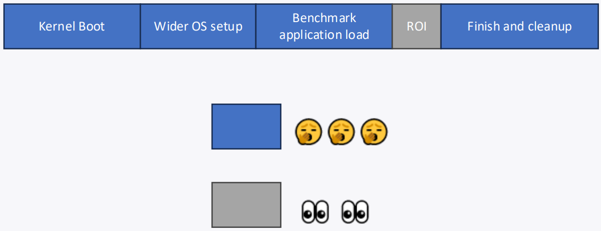

<!-- _class: title -->

## Accelerating gem5 simulations

In this section, we will cover how to accelerate gem5 simulations using fast-forwarding and checkpointing.

---

## gem5 is sllooww

(Not our fault: It’s the natural of simulation)


---

## Fortunately, there are some work arounds

### You don't need to simulate everything perfectly, or at all


---

## Simulations can always be made faster by simulating less


---

## This isn't always a bad thing... a lot of a simulation is of no interest to us



---

## our goal is to just run the ROI in detailed mode


### But how do we get to the ROI?

- Using KVM to fast-forward
- Taking and restoring a checkpoint

---

## Fast-forwarding with KVM

- KVM: Kernel-based virtual machine
-

```c
int main() {
  char[] hello = "hello world!";
  if (true) {
    printf(hello);
  }
}
```

---

